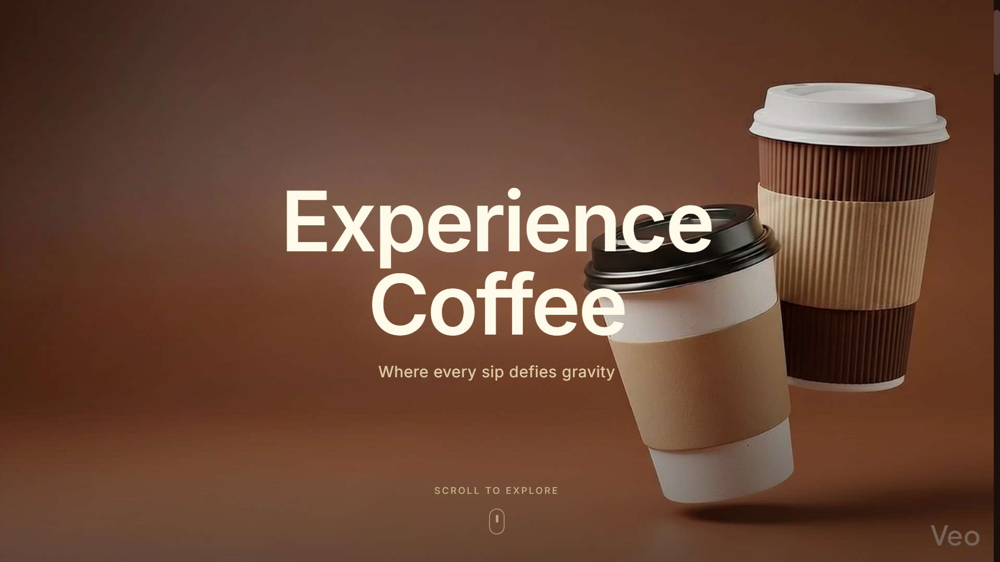
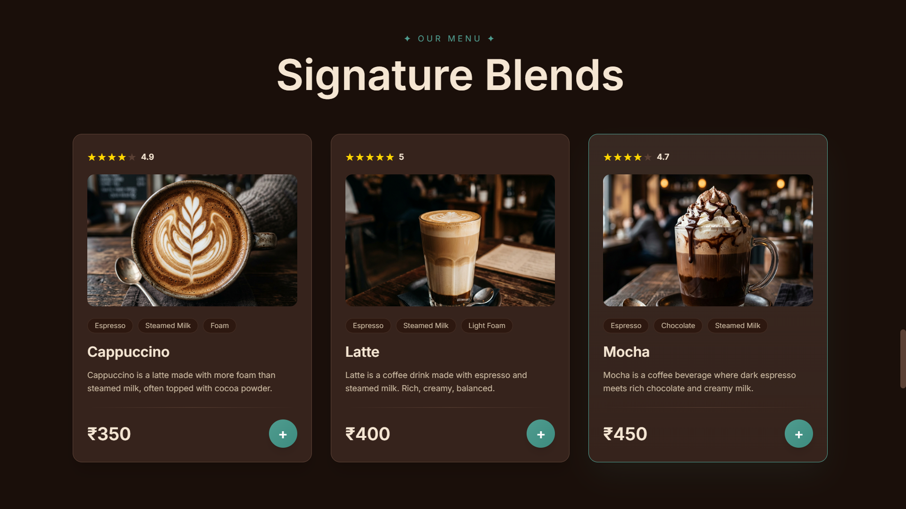
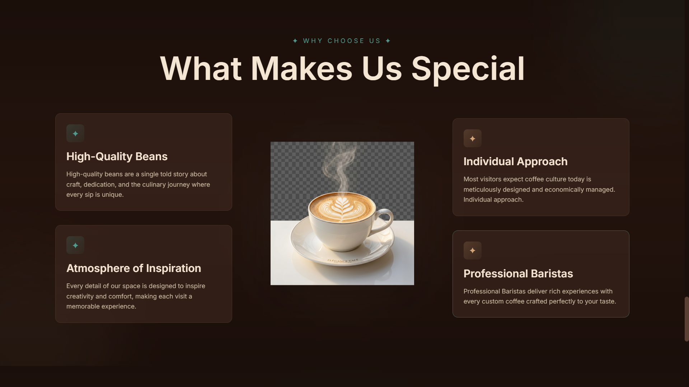

# Coffee Shop Landing Page

https://coffee-landing-orcin.vercel.app/

A cinematic coffee shop landing page built with Next.js 16, React 19, Tailwind v4, and Framer Motion.

Features
- Scroll-driven hero canvas animation
- Product showcase
- Feature highlights
- Smooth motion transitions
- Fully static export deployment

Tech Stack
Next.js 16
React 19
Tailwind CSS v4
Framer Motion

Deployment
Static export using Next.js.

Live Demo:
(link)

## Preview

### Hero Section

### Product Showcase

### Features
